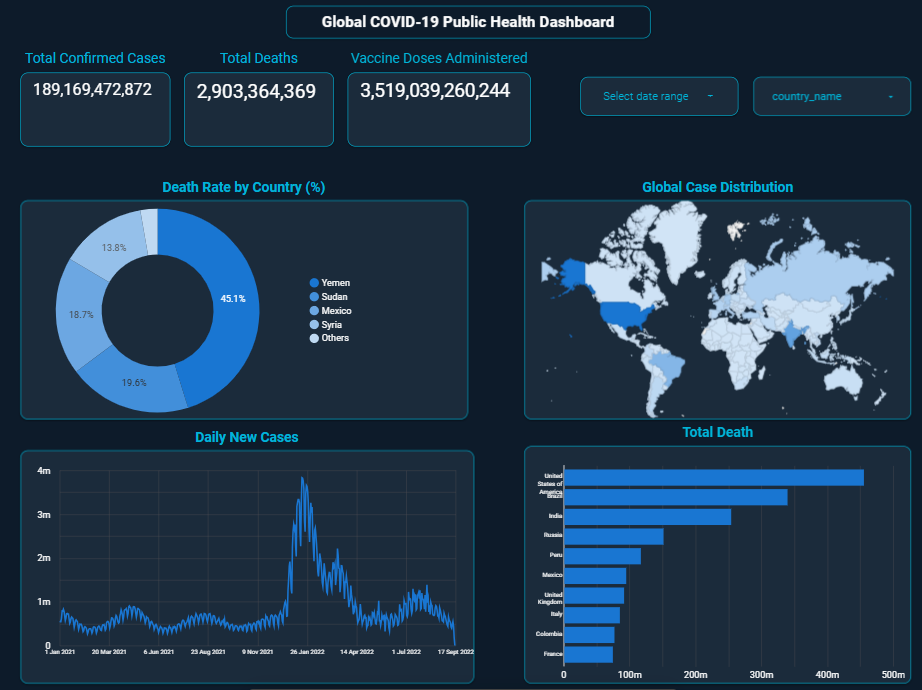

# Global COVID-19 Public Health Dashboard

An interactive public health dashboard built with Google BigQuery and Looker Studio, analyzing COVID-19 trends across 180+ countries.

## Live Dashboard
[View Dashboard](https://datastudio.google.com/reporting/a826e535-e0e2-418f-9aeb-237cddf31343)

## Screenshot

## Tools Used
- **BigQuery SQL** — queried Google's public COVID-19 dataset
- **Looker Studio** — built interactive visualizations
- **Calculated Metrics** — engineered Death Rate % field

## Key Features
- KPI scorecards — Total Cases, Deaths, Vaccine Doses
- Death Rate by Country donut chart (cumulative_deceased / cumulative_confirmed)
- Global case distribution geo map
- Daily new cases time-series showing COVID waves
- Top 10 countries by total deaths bar chart
- Interactive country and date range filters

## Insight
The Death Rate % metric reveals that Yemen, Sudan, and Syria had disproportionately high death rates — reflecting limited testing capacity and healthcare system strain rather than raw case volume alone.
